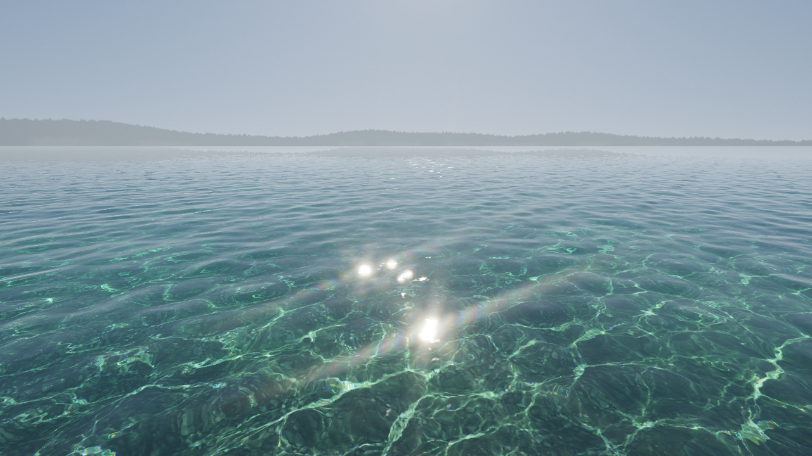

# Clearwater

Real-time, photoreal shallow water in a single HTML file. WebGL2, no libraries, no build step, no external assets.

**[Live demo](https://aureliengmz.github.io/clearwater/)** · drag to look around · tap the water

## Run

Open `index.html` in a browser, from disk or any static host. Nothing to install.

Needs WebGL2 with float render targets (`EXT_color_buffer_float`). Resolution adapts to keep the frame rate up.

| URL option | Effect |
| --- | --- |
| `?debug` | Frame rate, resolution, quality level |
| `?noglare` | Disable lens-diffraction glare |
| `?t=5` | Freeze time at 5 s (screenshots) |
| `?yaw=0.5&pitch=-0.4` | Initial camera direction, radians |
| `?view=caus` | Show the raw caustics texture |

## Code map

Everything lives in `index.html`, in sections marked `/* ---- Name ---- */`:

| Section | What to tweak |
| --- | --- |
| Ocean spectrum (FFT) | `L` patch size, `DEPTH`, `TARGET_SLOPE` wave steepness |
| Interactive ripples | `RN`, `RSIZE` simulation grid |
| Caustics | `G` ray grid, `C` caustics resolution, `IORS` per-channel refraction |
| Main water shader | Fresnel, absorption, seabed shading (GLSL) |
| Post / Lens diffraction glare | Bloom, glare, tone curve, grain |
| Camera & input | `SUN_EL`, `SUN_AZ` sun position, `VFOV` |
| Loop | Frame loop, adaptive quality |

The seabed texture is base64 in `<script id="pebbles-texture">` at the end of the file. To regenerate it: `python tools/make_pebbles.py` (numpy, scipy, pillow), then paste the base64 JPEG into that block.

## References

- Jerry Tessendorf, *Simulating Ocean Water*: FFT waves
- Evan Wallace, *WebGL Water*: refracted-grid caustics
- Inigo Quilez, *Texture repetition*: seabed tiling
- Marc Olano & Dan Baker, *LEAN Mapping*: distant highlights

## Credits

 Made by [Aurélien](https://x.com/Aurelien_Gz) at
<a href="https://lumaris.works"><picture><source media="(prefers-color-scheme: dark)" srcset="media/lumaris-dark.svg"></picture></a> [Lumaris](https://lumaris.works).

MIT License, see [LICENSE](LICENSE).
