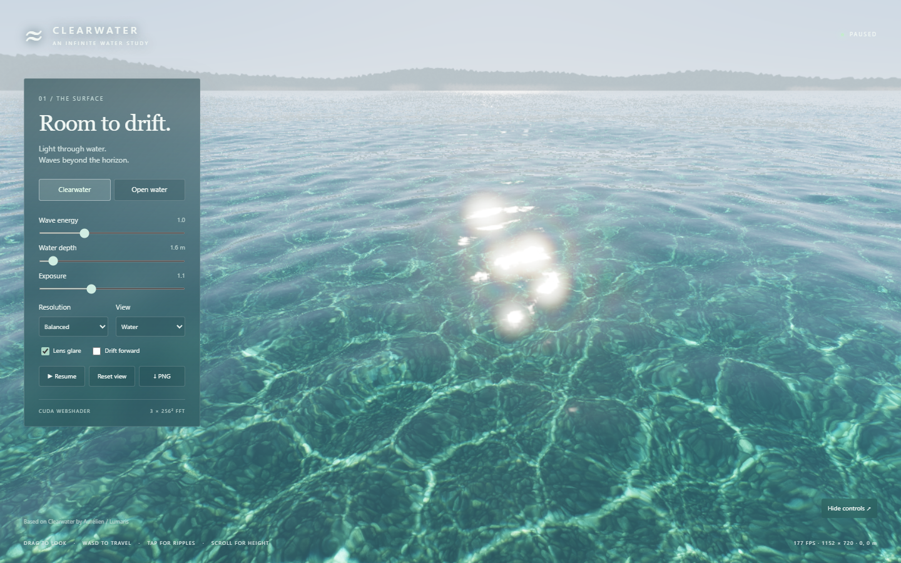

# Clearwater — CUDA infinite water

A CUDA reimplementation of [Aurélien / Lumaris's Clearwater](https://github.com/Aureliengmz/clearwater), extended with three FFT ocean scales and unrestricted camera travel.



All simulation and image formation lives in [`src/clearwater.cu`](src/clearwater.cu). The browser executes it through [SamG-Coder/cuda-webshader](https://github.com/SamG-Coder/cuda-webshader): CUDA source → generated WGSL → WebGPU. JavaScript handles DOM controls, asset decoding, resources, dispatch and presentation. The active application has no WebGL, Three.js, handwritten WGSL, CPU wave simulation or CPU FFT.

## Run

Requires Node.js 20+ and a browser with WebGPU enabled. Serve over localhost or HTTPS.

```powershell
npm ci
npm start
```

Open **http://localhost:5173**. For another port: `$env:PORT='5186'; npm start`.

- Drag or use arrow keys to look: right/left and up/down follow your input direction.
- WASD flies relative to the camera; W follows the direction you are looking, including pitch. E rises and Q descends, with a minimum camera height of 0.65 m.
- Scroll up to increase travel speed, down to decrease it (0.1–200 m/s). Hold either Shift for a temporary 6× boost. Current speed appears in the footer.
- Click nearby water to generate ripples.
- Space pauses; H hides controls; Reset view returns to the starting point.
- Clearwater and Open water presets set wave energy, depth and camera position.
- Depth, exposure, resolution, caustic/normal diagnostics, lens glare and continuous drift are adjustable.
- PNG saves the rendered image. `?t=5` opens at a fixed wave time.

## CUDA pipeline

| Stage | Implementation |
|---|---|
| Spectrum | Seeded Gaussian complex coefficients, directional spectral bumps and GPU RMS slope normalization |
| Wave evolution | Gravity/capillary dispersion with finite-depth tanh(k·depth) |
| Infinite surface | Three independently seeded 256² periodic cascades spanning 4.6 m, 37 m and 293 m, sampled in world space |
| FFT | 16 Stockham butterfly passes per 2D transform, two packed complex fields; height and analytic slopes |
| Interaction | 256² camera-relative ripple field, 16 m wide, fixed 120 Hz wave equation and integer-cell recentering |
| Caustics | 1024² refracted rays, three refractive indices, bilinear fixed-point atomic splats into a 512² RGB field |
| Water optics | Height-field intersection, Fresnel reflection, Snell refraction, Beer–Lambert extinction, underwater scattering, pebble/sand seabed and sun highlights |
| Lens | CUDA aperture rasterization, wavelength-dependent diffraction PSF, forward FFT / multiplication / inverse FFT convolution, padded image to avoid wrapping ghosts |
| Output | Bloom and filmic tone curve in CUDA; direct GPU buffer-to-canvas copy |

The normal frame loop performs **zero GPU-to-CPU readbacks**. Explicit inspection and PNG export read data back on request. The full compiler/runtime module graph is vendored; no CDN is needed.

## Validation

```powershell
npm run check
# Start the server on port 5186 in another terminal, then:
npm test
```

`npm test` launches installed Microsoft Edge through Playwright with WebGPU. The validation port is 5186. Latest evidence is in [`previews/verification.json`](previews/verification.json).

- All 20 CUDA entries compile through the vendored CUDA frontend.
- The same `.cu` file also compiled to native PTX with NVIDIA CUDA Toolkit 13.3 (`nvcc -ptx`); native execution was not tested and no native application host is included.
- GPU 2D FFT compared against five analytic Fourier modes across both axes, all three cascades and both complex fields: maximum absolute error **3.89e-7**.
- Forward/inverse round trip error: **2.99e-7**.
- RGB caustic mean energy: **0.9922** (small fixed-point splat truncation loss).
- Lens point-spread function normalized to unity within **2.4e-7**.
- Finite wave state, HDR and diffraction buffers; click-generated ripples; WASD travel; finite state after travel to `(10000, -10000)` metres.
- Pause/reset, window resize, resolution selection, caustic/normal views and glare switching exercised.
- No browser console errors, page errors, failed HTTP requests or WebGPU validation errors in the recorded run.
- Visual captures inspected for shallow water and open water on an NVIDIA Blackwell adapter in Edge. Other hardware/browser combinations have not been tested.

## Scope and tradeoffs

“Infinite” means there is no finite mesh edge or camera travel boundary. The wave fields remain periodic, as FFT oceans are; combining three scales reduces obvious repetition. It is not an infinitely large stored simulation. World coordinates and GPU math use 32-bit floats, so precision eventually deteriorates at extreme travel distances; 10 km coordinates are covered by the test.

This is a linear spectral height-field ocean. It does not simulate overturning breakers, spray, volumetric water or an underwater camera. Shallow caustics are driven by the short-wave cascade at the selected mean depth, with local ripple curvature added during shading; the long-wave cascades are not included in the photon map. The caustic map and seabed remain periodic. Distant headlands are a procedural sky silhouette, not traversable terrain.

The optical design is reimplemented, not a pixel-identical port: the lens uses three representative wavelengths, and compute filtering replaces WebGL derivatives and texture mipmaps. The original web application and README are preserved in [`upstream/`](upstream/) for comparison. This project targets the CUDA WebShader subset and browser runtime; it is not a standalone native CUDA executable.

## Provenance

- Original Clearwater: [Aureliengmz/clearwater](https://github.com/Aureliengmz/clearwater), commit `4bc826134321043a25df3c2b6fed16fb7b9241e8`, MIT, copyright 2026 Lumaris. Original license retained at [`LICENSE`](LICENSE).
- Pebble image: extracted without modification from the original embedded asset into `assets/seabed.jpg`.
- CUDA WebShader: vendored compiler and runtime from local `D:\cuda-webshader`, commit `9011955806cee30636ba24ae34b22d218e84196f`, MIT; license at [`vendor/cuda-webshader/LICENSE`](vendor/cuda-webshader/LICENSE).
- Original design references: Tessendorf (FFT water), Evan Wallace (refracted-grid caustics), Inigo Quilez (texture repetition), Olano & Baker (LEAN mapping).
