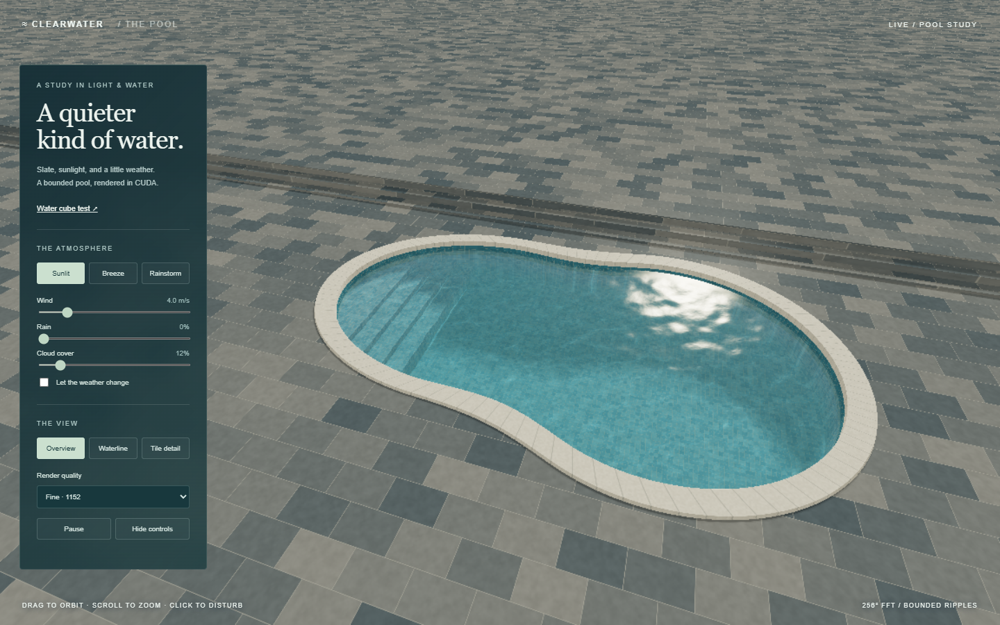
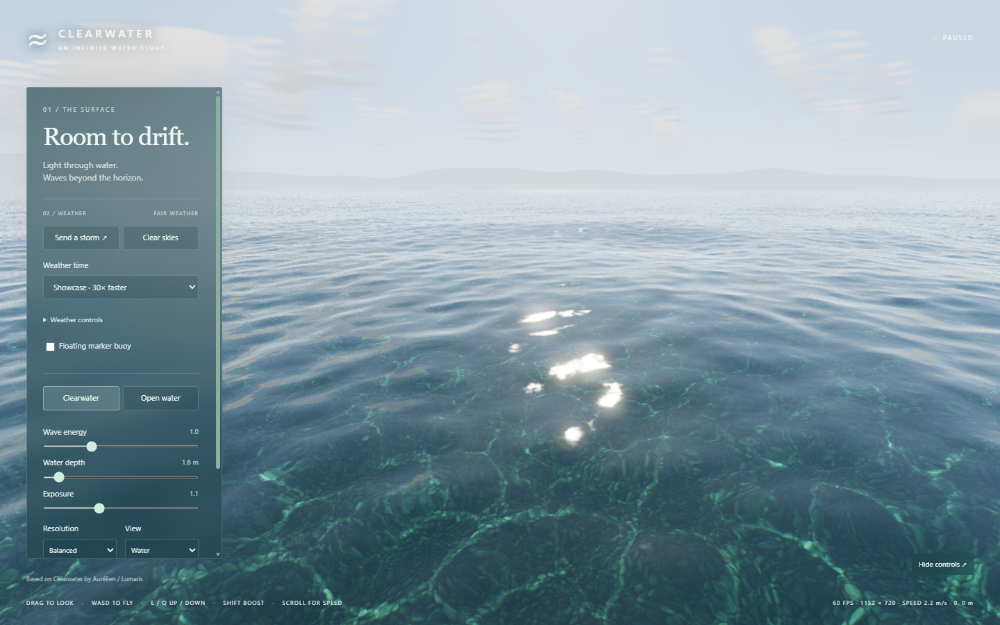
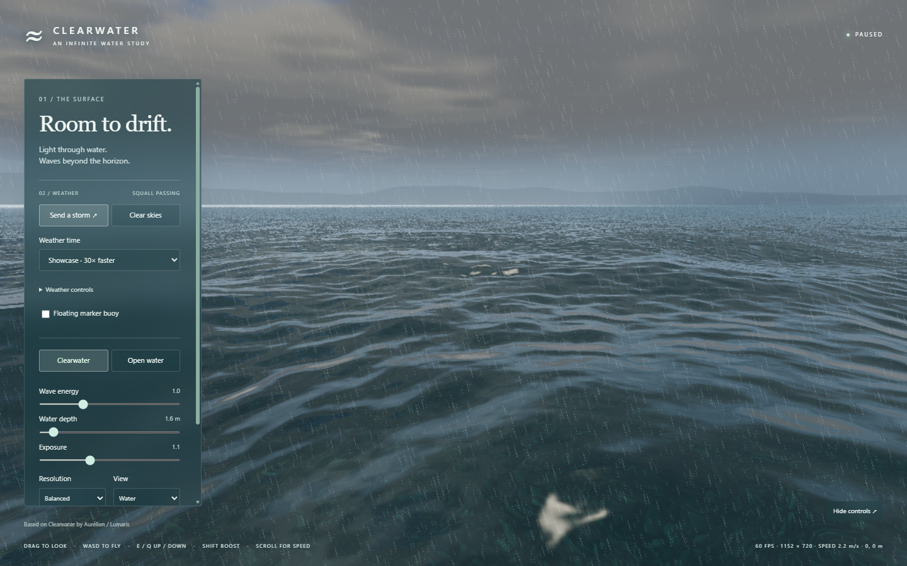

# Clearwater — CUDA infinite water

A CUDA reimplementation of [Aurélien / Lumaris's Clearwater](https://github.com/Aureliengmz/clearwater), extended with three FFT ocean scales, a moving weather front, and unrestricted camera travel.

**[Launch the live demo](https://samg-coder.github.io/clearwater/)** · [Native Windows version](Native/README.md)

**[Explore the pool study](https://samg-coder.github.io/clearwater/pool/)** — a separate CUDA demo focused on a curved swimming pool and its tilework.

## Reference matching study

**[Open the reference comparison](https://samg-coder.github.io/clearwater/study/)** or visit `/study/` locally. This is the water-component pass for the generated Jiangnan garden concept. It uses the reference's exact 1672 × 941 pixel grid, with adjustable opacity overlay, wipe, absolute RGB difference, and a scrollable 1:1 pixel inspection view. Pause locks wave time for repeatable comparisons; camera height, pitch, field of view, water depth, exposure, absorption, and ripple strength are adjustable.

[`study/study.cu`](study/study.cu) renders submerged stone, FFT refraction, RGB photon caustics, and isolated drop rings. The caustics use a bounded 4 m photon tile at the selected bed depth; this is an optical approximation. A procedural lighting proxy supplies reflected foliage and plaster. The reference PNG is a separate DOM comparison layer and is never sampled by the CUDA renderer. The upper scene remains gray because the garden architecture and plants have not been assembled. **The rendered content is not yet a pixel-perfect match.** Stone arrangement, reflections, and scene silhouettes remain unfinished.

The optional measurement button reads the GPU output and reports RGB MAE/RMSE for the outlined foreground-water rectangle. It excludes most surrounding objects, so it is not a full-scene score. Normal rendering performs no CPU readback. `npm run test:study` checks exact image/canvas alignment, row padding, comparison modes, pause, material controls, and measurement repeatability in Edge against port 5186. Save settings exports the comparison parameters as JSON.

## Water cube test

**[Open the water cube](https://samg-coder.github.io/clearwater/cube/)** or visit `/cube/` locally. This is a two-metre cubic optical volume testing the lotus-pond reference's clear jade water, visible weathered stone, rippled refraction, and moving caustics. Drag to orbit, scroll to zoom, and click the top surface to disturb it. The existing weather and view controls are available.

The CUDA renderer in [`cube/cube.cu`](cube/cube.cu) traces entry and exit through the cube, with wavelength-dependent absorption and up to four internal reflection segments. The top uses the shared short-wave FFT; rain and click impulses use a separate bounded 256² ripple field. The test reuses the pool's browser host rather than duplicating its GPU setup. The cubic boundary is an optical test constraint, not a freely suspended fluid simulation. The caustic map approximates overhead illumination of the stone base. Run `npm run test:cube` with the local server on port 5186.

## The pool study



Open `/pool/` on the local server or use the link above. This scene concentrates on the pool, pale segmented coping, submerged entry steps, ceramic mosaic lining, slate deck, and stepped terrace. Drag to orbit, scroll to zoom, or click the water to make a ripple. **Overview**, **Waterline**, and **Tile detail** provide three camera presets; **H** restores hidden controls.

Sunlit, Breeze, and Rainstorm presets control wind, rainfall, and cloud cover. **Let the weather change** sends the shared moving storm across the pool at an accelerated showcase rate. Wind energy takes time to build and settle; rain injects individual impulses into a fixed 120 Hz wave equation with reflecting basin boundaries. Wet paving darkens and reflects the sky. Pause freezes simulation time while leaving the camera usable.

Rain falls downward with a wind slant. Deterministic world-space drop events drive both visible contact crowns/expanding rings and the numerical surface impulses, making each splash visible where its ripple begins. The crowns are an analytic visual approximation, layered over the bounded wave field.

[`pool/pool.cu`](pool/pool.cu) supplies the geometry, procedural stone and ceramic materials, pool dynamics, ray-traced reflection/refraction, and shallow-water optics. It compiles together with the existing [`src/clearwater.cu`](src/clearwater.cu), reusing the FFT, spectral weather response, sky, Fresnel optics, photon filtering, and tone mapping. Only the short 4.6 m FFT band contributes to pool wind ripples; ocean swell is excluded. The scene contains no terrain or imported models/textures.

This is a real-time visual approximation: FFT wind ripples taper near the wall, the bounded solver handles rain and click impulses, and the RGB photon map uses a representative 1.5 m depth rather than a full light-transport solve on every step and wall. The pool is currently a browser sub-demo; the existing native ocean application is unchanged. Actions compile both CUDA demo paths for WebGPU and package both Pages entry points; they do not build native CUDA.

Run `npm run test:pool` against the local server on port 5186 for GPU residency, bounded-ripple, weather, pause, controls, and screenshot checks.

The live demo runs directly in a WebGPU-capable browser; no installation is needed.



Simulation and image formation live in [`src/clearwater.cu`](src/clearwater.cu), with the pool-specific geometry and optics in [`pool/pool.cu`](pool/pool.cu). The browser executes it through [SamG-Coder/cuda-webshader](https://github.com/SamG-Coder/cuda-webshader): CUDA source → generated WGSL → WebGPU. JavaScript handles DOM controls, asset decoding, resources, dispatch and presentation. The active application has no WebGL, Three.js, handwritten WGSL, CPU wave simulation or CPU FFT.

## Run

The browser version and the Windows native application share `src/clearwater.cu`. For the native build with a separate control window, see [`Native/README.md`](Native/README.md).

Requires Node.js 20+ and a browser with WebGPU enabled. Serve over localhost or HTTPS.

```powershell
npm ci
npm start
```

Open **http://localhost:5173**. For another port: `$env:PORT='5186'; npm start`.

- Drag or use arrow keys to look: right/left and up/down follow your input direction.
- WASD flies relative to the camera; W follows the direction you are looking, including pitch. E rises and Q descends, with a minimum camera height of 0.65 m.
- Scroll up to increase travel speed, down to decrease it (0.1–200 m/s). Hold either Shift for a temporary 6× boost. Current speed appears in the footer.
- Click nearby water to generate ripples.
- Space pauses; H hides controls; Reset view returns to the starting point.
- Clearwater and Open water presets set wave energy, depth and camera position.
- Depth, exposure, resolution, caustic/normal diagnostics, lens glare and continuous drift are adjustable.
- PNG saves the rendered image. `?t=5` opens at a fixed wave time.

## A passing storm

Click **Send a storm** and watch the horizon. The default showcase advances weather 30 times faster while the waves and rain continue moving at normal simulation speed. Near the starting position, the strongest conditions arrive after about 30 seconds, with clearing skies around 70 seconds. Select **Real time** for uncompressed weather evolution. **Clear skies** removes the storm forcing; the waves relax gradually.

- A moving world-space storm band drives local rain, cloud cover, visibility and wind forcing at the camera.
- A JONSWAP-shaped directional weighting redistributes energy in the short and medium FFT bands. Stored spectral energy responds gradually; decay is slower than growth, and the independent long swell is preserved.
- Raindrops inject impulses into the existing 120 Hz ripple solver. Wind-slanted rain streaks and a distant rain veil make the rainfall visible.
- Eight cloud layers approximate an atmospheric volume. Clouds dim sunlight and caustics, with the same sky sampled for water reflections. Lightning illuminates that sky and reflects across the waves.
- Strong, elevated crests generate foam in a persistent GPU field, advected with wind drift and faded over time.
- Wind, direction, storm strength, rain and cloud cover have separate controls. The optional marker buoy follows the sampled height and slope; it is a visual scale reference.



## CUDA pipeline

| Stage | Implementation |
|---|---|
| Spectrum | Seeded Gaussian complex coefficients, directional spectral bumps and GPU RMS slope normalization |
| Wave evolution | Gravity/capillary dispersion with finite-depth tanh(k·depth), per-mode wind-energy memory |
| Weather | Moving storm band, lagged local wind, layered clouds, shadow attenuation, rain optics and reflected lightning |
| Foam | Persistent 256² field, crest/slope source, wind advection and exponential decay |
| Infinite surface | Three independently seeded 256² periodic cascades spanning 4.6 m, 37 m and 293 m, sampled in world space |
| FFT | 16 Stockham butterfly passes per 2D transform, two packed complex fields; height and analytic slopes |
| Interaction | 256² camera-relative ripple field, 16 m wide, fixed 120 Hz wave equation and integer-cell recentering |
| Caustics | 1024² refracted rays, three refractive indices, bilinear fixed-point atomic splats into a 512² RGB field |
| Water optics | Height-field intersection, Fresnel reflection, Snell refraction, Beer–Lambert extinction, underwater scattering, pebble/sand seabed and sun highlights |
| Lens | CUDA aperture rasterization, wavelength-dependent diffraction PSF, forward FFT / multiplication / inverse FFT convolution, padded image to avoid wrapping ghosts |
| Output | Bloom and filmic tone curve in CUDA; direct GPU buffer-to-canvas copy |

The normal frame loop performs **zero GPU-to-CPU readbacks**. Explicit inspection and PNG export read data back on request. The full compiler/runtime module graph is vendored; no CDN is needed.

## Validation

```powershell
npm run check
# Start the server on port 5186 in another terminal, then:
npm test
npm run test:weather
```

`npm test` launches installed Microsoft Edge through Playwright with WebGPU. The validation port is 5186. Latest evidence is in [`previews/verification.json`](previews/verification.json).

- All 22 CUDA entries compile through the vendored CUDA frontend.
- The native application built with CUDA Toolkit 13.3 and passed its GPU smoke test on an RTX 5080: FFT error **2.47e-7**, ripple generation, 6x Shift boost, separate windows, resizing, diagnostic views and finite values at 10 km. See [`previews/native-smoke.json`](previews/native-smoke.json). Full manual control-window QA remains incomplete.
- Weather validation passes in Edge/WebGPU and native CUDA: the medium-wave band RMS rises from **0.086 m to 0.194 m** in the recorded browser scenario, rain generates nonzero ripple heights, foam remains bounded, pause freezes both clocks, and stored wave energy remains elevated after the wind eases. See [`previews/weather-verification.json`](previews/weather-verification.json) and [`previews/native-weather.json`](previews/native-weather.json). These are implementation checks, not oceanographic calibration.
- GPU 2D FFT compared against five analytic Fourier modes across both axes, all three cascades and both complex fields: maximum absolute error **3.89e-7**.
- Forward/inverse round trip error: **2.99e-7**.
- RGB caustic mean energy: **0.9922** (small fixed-point splat truncation loss).
- Lens point-spread function normalized to unity within **2.4e-7**.
- Finite wave state, HDR and diffraction buffers; click-generated ripples; WASD travel; finite state after travel to `(10000, -10000)` metres.
- Pause/reset, window resize, resolution selection, caustic/normal views and glare switching exercised.
- No browser console errors, page errors, failed HTTP requests or WebGPU validation errors in the recorded run.
- Visual captures inspected for shallow water and open water on an NVIDIA Blackwell adapter in Edge. Other hardware/browser combinations have not been tested.

## Scope and tradeoffs

“Infinite” means there is no finite mesh edge or camera travel boundary. The wave fields remain periodic, as FFT oceans are; combining three scales reduces obvious repetition. It is not an infinitely large stored simulation. World coordinates and GPU math use 32-bit floats, so precision eventually deteriorates at extreme travel distances; 10 km coordinates are covered by the test.

The weather system is a visual, physically motivated approximation, not a forecast or a calibrated wind/fetch model. Wind forcing is uniform across the FFT tiles and sampled from the front at the camera; spatial gust shading does not solve local fluid momentum. Foam uses a slope/height heuristic, clouds use layered density integration, and the buoy uses surface-following animation rather than rigid-body buoyancy.

This is a linear spectral height-field ocean. It does not simulate overturning breakers, spray, volumetric water or an underwater camera. Shallow caustics are driven by the short-wave cascade at the selected mean depth, with local ripple curvature added during shading; the long-wave cascades are not included in the photon map. The caustic map and seabed remain periodic. Distant headlands are a procedural sky silhouette, not traversable terrain.

The optical design is reimplemented, not a pixel-identical port: the lens uses three representative wavelengths, and compute filtering replaces WebGL derivatives and texture mipmaps. The unused original WebGL application, old media/tools and unused vendor helpers have been removed; they remain available in Git history. The browser targets CUDA WebShader, while `Native/main.cu` directly includes the same kernels for native CUDA execution.

## Actions and Pages

Published site: **[samg-coder.github.io/clearwater](https://samg-coder.github.io/clearwater/)**.

`npm run build` stages the browser entry, all 37 required JavaScript modules, shared CUDA source, seabed asset and licenses into `dist/`, with relative URLs and `.nojekyll` for Pages. Actions runs browser checks and Pages deployment only: pull requests are checked and built, and pushes to `main` deploy the site. Build the native application locally using `Native/build.ps1`; native CUDA builds do not run on Actions.

## Provenance

- Original Clearwater: [Aureliengmz/clearwater](https://github.com/Aureliengmz/clearwater), commit `4bc826134321043a25df3c2b6fed16fb7b9241e8`, MIT, copyright 2026 Lumaris. Original license retained at [`LICENSE`](LICENSE).
- Pebble image: extracted without modification from the original embedded asset into `assets/seabed.jpg`.
- CUDA WebShader: vendored compiler and runtime from local `D:\cuda-webshader`, commit `9011955806cee30636ba24ae34b22d218e84196f`, MIT; license at [`vendor/cuda-webshader/LICENSE`](vendor/cuda-webshader/LICENSE).
- Original design references: Tessendorf (FFT water), Evan Wallace (refracted-grid caustics), Inigo Quilez (texture repetition), Olano & Baker (LEAN mapping).
